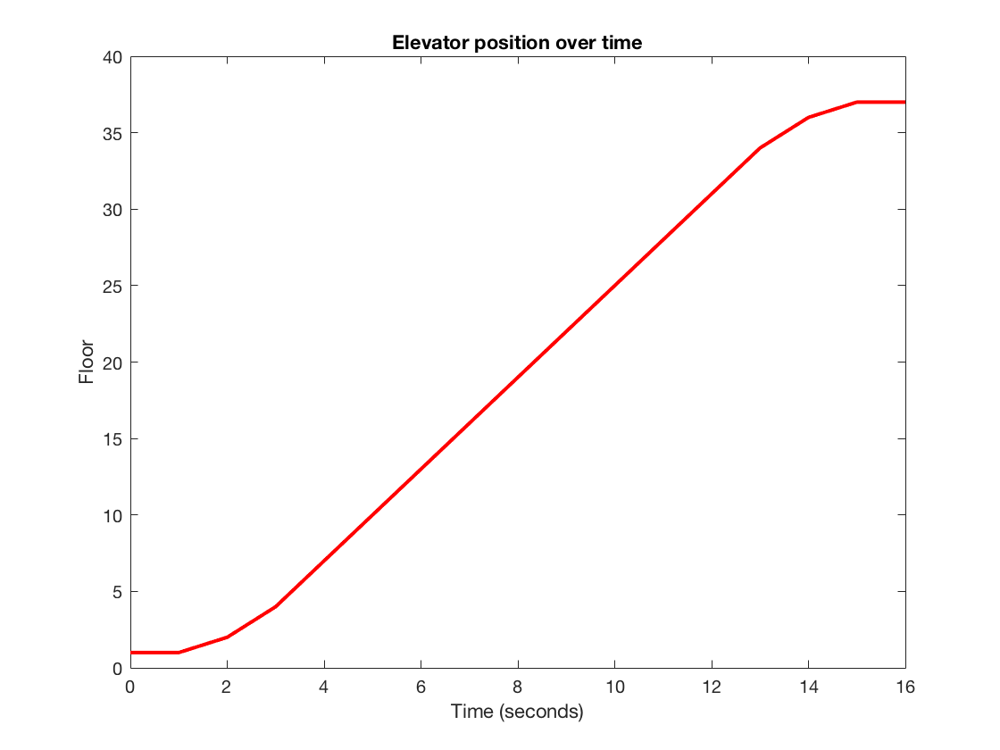

Control systems are everywhere - your computers, your cars, your buildings, and your daily routines. The conspiracy even goes so deep as to include yourself! 

Now, before you ask "*why would I make such a bold conspiracy theory?*" (or "*why would I use such a clickbait hook?*") I should explain what control systems are. If that sounds like a boring topic, I'm hoping that dreadful hook will suspend your disinterest for at least a few more sentences.

Control systems are fancy function boxes that take an input and produce an output that we want. For example, let's consider an elevator. 

> You arrive at your apartment complex tired after a long workday. Pushing the up button, you wait for the elevator doors to open, then push the button corresponding to the 37th floor on entering.

Let's say that the elevator started at the ground floor, so it opens immediately. You push the correct floor button a couple seconds later. The elevator ascends:

| Time (seconds) | Floor |
|----------------|-------|
| 0 | 1 |
| 1 | 1 |
| 2 | 1 |
| 3 | 2 |
| 4 | 4 |
| 5 | 7 (*you have a pretty fast elevator*) |
| ... | ... |

Now that I've over-illustrated my example, I can say that an elevator is a very approachable control system. Here, we gave it an input of 1 by calling it at the bottom floor, and since it was already there the control system didn't have to do anything. Then, we gave it an input of 37, and it brought us there comfortably. Some things to consider:
- *This example is suspiciously good. Where did you get it from?* This was inspired by a textbook called *Control Systems Engineering* by Norman S. Nise. The numbers are my own creation, rest assured.
- *How did it know which floor to go to?* The answer is that "somebody did a good job with designing the controller". In the past, humans had to do this. It is not very common anymore. [(Wikipedia Link)](https://en.wikipedia.org/wiki/Elevator_operator)
- *Why is the graph not a straight line?* Elevators accelerate slowly so that human riders remain comfortable. As Nise states:

> "In our example, passenger comfort and passenger patience (depend on the elevator response). If this response is too fast, passenger comfort is sacrificed. If this response is too slow, passenger patience is sacrificed."

Some more examples of control systems:
- **Cars**: Cruise control, engines, ABS, temperature control, automatic transmission...
- **Airplanes**: Rudders, ailerons, flight control, wing flaps
- **Homes**: Thermostat, fusebox, router, light switch
- **Computers**: CPU, Monitor, Speakers, Keyboard, Microphone
- **Humans**: Brains, immune systems, endocrine systems, hormone cycles

## What it all means

Control systems is a very important and wide reaching part of engineering. Many different types of technology owe their existence to control systems, and many different fields contribute to control theory. The device you're probably using to read this post (or the device you used to print it, if that's your thing) is the culmination of several decades of fascinating progress in control systems evolution, but I won't include that here. If you're interested, look to the next post!
